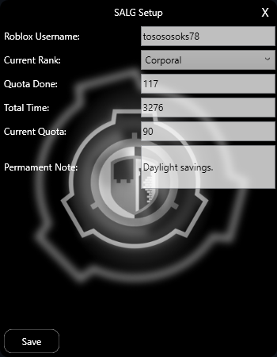
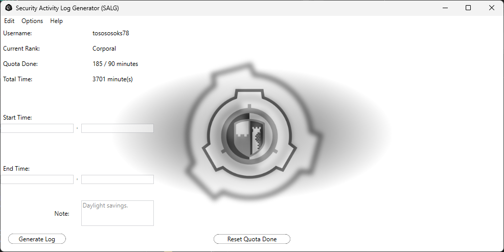
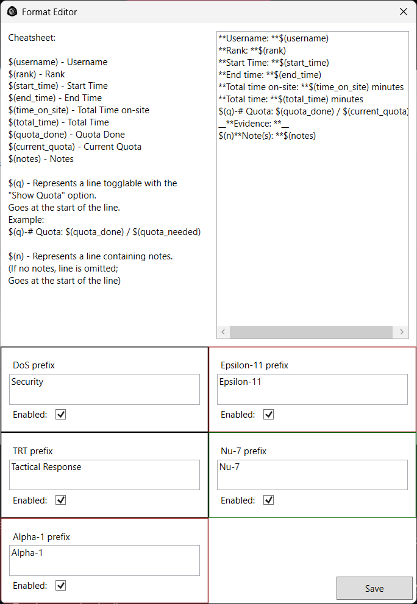
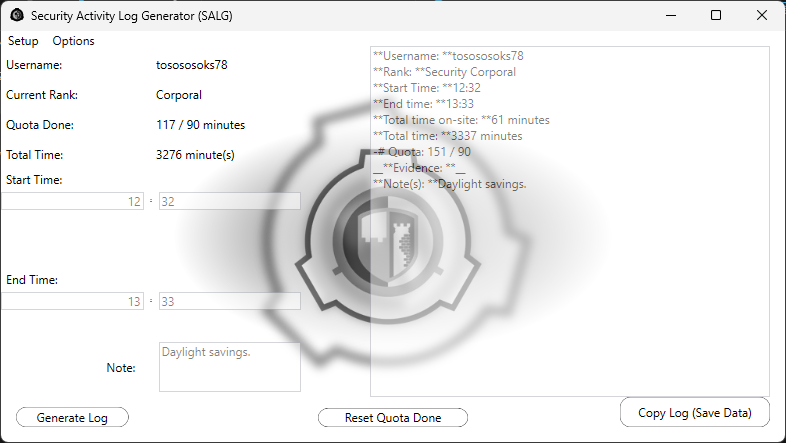

# Security Activity Log Generator (SALG for short)
is a tool for all my fellow **Site-19'ers** which includes the following:
  - Quota and Total Time management,
  - Total Time on-site calculator, ***(You still have to add that 1 hour if affected by DS)***
  - Permanent Notes, *(Notes that appear every time you make a log)*
  - Activity Log Generator, *(Kind of the main thing)*
  - Quota Hiding
  - The entirety of DoS *(And TRT)* and MTF ranks
  - Customizable format and prefixes

# Usage

## Setup

Upon the first launch of the application *(Or if it has been fired from the Main Menu)*, you'll be asked to fill the following:
  1. Your Roblox Username,
  2. Your Rank (Dropdown list, no writing)
  3. Minutes of the Quota done,
  4. Your Total Time,
  5. The Current Quota
  6. Permanent Note

*After that, there will be a folder called "SALG" created in your `%appdata%` directory which will contain:*
  - data.json - **data** in previous releases
  - prefs.json - **misc** in previous releases
  - notes.txt - **notes** in previous releases
  - backup folder - self-explanatory, stores your backups

*These files store your data. Run the "Remove Data.bat" included in every release if you wish to delete your data.*

### SALG will automatically load the data files from the [console version](https://github.com/Tosoks67/SALG-Console) if you run it in the same directory as it

## Main Menu

This the section from which you'll basically control everything.

In here, you can:
 
### On the Menu
  - Run Setup again
  - Change the Format
  - Toggle whether you want your Quota Done shown
  - Toggle Dark Mode
  - Choose (sub)department ranks ***(Will trigger Setup again)***
  - Open the About window
  - View the License

### On the main UI
  - Generate a log
  - Reset your `Quota Done`

## Changing the Activity Log Format

As you might've guessed, in here you can change the format of your logs.
The `$()` values get replaced by their corresponding data

The `$(q)` marker goes at the start of a line you want to be togglable using the **Show Quota** feature *(It basically just removes the line(s) if **Show Quota** is unchecked)*

The `$(n)` marker goes at the start of a line you want to contain notes *(What this does is remove the marked line(s) if the **Note** field is empty)*

### Full list of all the markers:
- $(username) - Username
- $(rank) - Rank *(Includes the prefix customizable below)*
- $(start_time) - Start Time
- $(end_time) - End Time
- $(time_on_site) - Total Time on-site
- $(total_time) - Total Time
- $(quota_done) - Quota Done
- $(current_quota) - Current Quota
- $(notes) - Notes
- 
- $(q) - Explained earlier
- $(n) - Explained earlier

## Generating Activity Logs

The process itself is quite simple.

The space labelled `Note: ` will always be autofilled with your Permanent Note. You can modify it however you want.

You just need to fill the start and end hour and minute. ***(You can use arrows to move between the input boxes; 2 numbers maximum for each box)***

After that, the app does the rest ***(And you can finally paste that log onto the discord server)***.

*(I highly recommend to keep `Show Quota` checked to save HR some time)*

### Your data gets rewritten only after you click the *Copy Log* button

# Contact
If you encounter any bugs, errors of any type, or just want to suggest something,
be sure to contact me.

## Discord Username: *tosososoks78*
