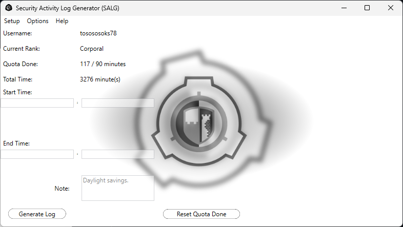

# Security Activity Log Generator (SALG for short)
is a tool for all my fellow **DoS officers** which includes the following:
  - Quota and Total Time management,
  - Total Time on-site calculator, ***(You still have to add that 1 hour if affected by DS)***
  - Permament Notes, *(Notes that appear every time you make a log)*
  - Activity Log Generator, *(Kind of the main thing)*
  - Quota Hiding

# Usage

### SALG (Application) has multiple files, so you pretty much have to store it inside a folder.

## Setup

Upon the first launch of the application *(Or if it has been fired from the Main Menu)*, you'll be asked to fill the following:
  1. Your Roblox Username,
  2. Your Rank (Dropdown list, no writing)
  3. Minutes of the Quota done,
  4. Your Total Time,
  5. The Current Quota
  6. Permament Note

*After that, an extensionless file called "data" and "notes" **(If Permament Note was specified)** will be created.*

*These files store your data. Do NOT delete them **(Unless you wish to delete all of your data that is)***

*There's also a file called "misc" that will be created. It stores your preferences **(Dark Mode, TRT ranks)***

### SALG (Application) and the console version of it use the same data format *(meaning that you can use "data" and "notes" for both versions)*

## Main Menu

This the section from which you'll basically control everything.

In here, you can:
 
### On the Menu
  - Run Setup again
  - Toggle whether you want your Quota Done shown
  - Toggle Dark Mode
  - Toggle TRT ranks ***(I only added the ranks, as I don't know how your logs look, sorry; Might add customizable logs in the future; Will trigger Setup again)***
  - View the License

### On the main UI
  - Generate a log
  - Reset your `Quota Done`

## Generating Activity Logs

The process itself is quite simple.

The space labelled `Note: ` will always be autofilled with your Permament Note. You can modify it however you want.

You just need to fill the start and end hour and minute. ***(You can use arrows to move between the input boxes; 2 characters maximum for each box)***

After that, the app does the rest ***(And you can finally paste that log onto the discord)***.

The `-# Quota: Quota Done / Current Quota` part will be removed if your `Show Quota` is off.

*(I highly recommend to keep `Show Quota` checked to save HR some time **[Unless you're NCO+ that is]**)*

# Contact
If you encounter any bugs, errors of any type, or just want to suggest something,
be sure to contact me.

## Discord Username: *tosososoks78*
